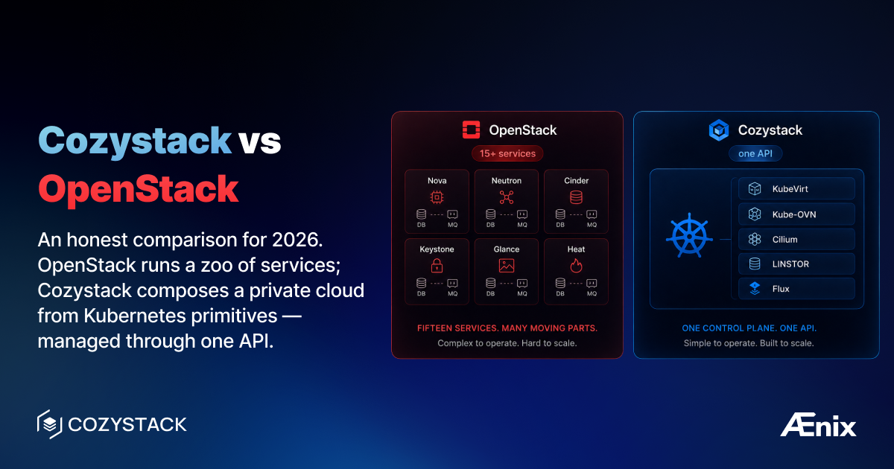

Более десяти лет OpenStack был ответом по умолчанию на вопрос «как нам построить частное облако?» — широкий набор возможностей, обширная экосистема вендоров, гравитация первопроходца. Но всё больше команд обнаруживают, что эксплуатация OpenStack сама по себе является работой на полную ставку. Дрейф конфигураций между десятками взаимодействующих сервисов, болезненные обновления, которые блокируют целые спринты, и кадровый резерв, который сокращается по мере того, как инженеры тяготеют к Kubernetes-нативному инструментарию.

Cozystack использует иной подход. Вместо специализированной облачной плоскости управления он собирает её из примитивов Kubernetes: KubeVirt для виртуальных машин, Cilium и Kube-OVN для сетей, LINSTOR/DRBD для хранилища, Flux для согласования. Результат — бесплатная PaaS с открытым исходным кодом, проект уровня CNCF Sandbox, предоставляющий виртуальные машины, управляемые кластеры Kubernetes, VPC и управляемые сервисы на «голом железе» — всё через единый API Kubernetes. Иными словами, Kubernetes-нативная альтернатива OpenStack.

Эта статья сравнивает две платформы по семи направлениям, чтобы помочь вам решить, что подходит вашей команде и вашим рабочим нагрузкам.

## Архитектура

OpenStack — это набор проектов: Nova, Neutron, Cinder, Keystone, Glance, Heat, Horizon — каждый со своим ритмом релизов, схемой API, базой данных и потребителями очереди сообщений. Минимальное продакшн-развёртывание включает как минимум пять основных сервисов в режиме HA с MariaDB/Galera, RabbitMQ и парками агентов на каждом узле. Преимущество — модульность: замените драйвер ML2 в Neutron, не трогая Nova, запустите Cinder с десятками бэкендов. Недостаток — площадь поверхности: каждый сервис — это ещё одна вещь, которую нужно мониторить, обновлять и отлаживать в 3 часа ночи, а межсервисные сбои трудно отследить.

Cozystack исходит из иной предпосылки: Kubernetes уже предоставляет планирование, проверку состояния, обнаружение сервисов, RBAC и декларативный API. Каждый компонент — KubeVirt, Kube-OVN, LINSTOR, Keycloak — работает как рабочая нагрузка Kubernetes, управляемая через Flux HelmReleases. Никакой отдельной очереди сообщений, никакой базы данных на каждый сервис, никакого дополнительного парка агентов. Любой, кто понимает Kubernetes, может исследовать, отлаживать и расширять платформу. Компромисс: Cozystack моложе, имеет меньшую стороннюю экосистему и наследует ограничения своих компонентов.

## Вычисления

| Возможность | OpenStack | Cozystack |
|---|---|---|
| Виртуальные машины | Nova + libvirt/KVM | KubeVirt + libvirt/KVM |
| Контейнеры | Zun (редко развёртывается) | Нативные поды Kubernetes |
| Управляемый Kubernetes | Magnum | Kamaji + Cluster API |
| Проброс GPU | Поддерживается | Поддерживается |
| Живая миграция | Поддерживается | Поддерживается |

Nova проверен в бою, обслуживает тысячи виртуальных машин в продакшене с глубокой поддержкой гипервизора — привязка NUMA, SR-IOV, полная матрица libvirt. KubeVirt, вычислительный движок Cozystack, запускает виртуальные машины как поды Kubernetes с внутренним доменом libvirt. Виртуальные машины и контейнеры используют общий планировщик, сеть и хранилище, поэтому команда, запускающая устаревшую Windows рядом с контейнеризированными микросервисами, управляет всем через единый API. KubeVirt поддерживает живую миграцию, горячее подключение CPU/памяти и проброс GPU (с обычной оговоркой — общей с Nova, — что виртуальные машины с проброшенными устройствами не могут быть подвергнуты живой миграции). Он не воспроизводит каждую нишевую функцию Nova (для провижининга «голого железа» через Ironic нет эквивалента), но для большинства нагрузок на виртуальных машинах разрыв незначителен.

Для управляемого Kubernetes разница резче. Magnum провижинит кластеры на виртуальных машинах Nova с помощью шаблонов Heat, но мониторинг, обновления и резервное копирование etcd в значительной степени остаются вашей заботой. Cozystack использует Kamaji вместе с Cluster API для запуска плоскостей управления арендаторов как подов в управляющем кластере, устраняя выделенные виртуальные машины плоскости управления и позволяя запускать сотни легковесных кластеров.

## Сети

Neutron мощный, но операционно сложный. Типичное развёртывание включает агенты OVS или OVN на каждом вычислительном узле, L3-агенты, DHCP-агенты и агенты метаданных. У каждого свои режимы отказа — переключение L3-агента может «подвесить» плавающие IP, перезапуски DHCP вызывают «штормы аренды». Отладка означает сопоставление логов между агентами на нескольких узлах.

Cozystack разделяет сети на две задачи. Cilium обрабатывает трафик между подами в управляющей сети с помощью eBPF, с нативными сетевыми политиками и опциональной наблюдаемостью через Hubble. Kube-OVN обрабатывает сети VPC арендаторов, используя ту же плоскость данных OVN/OVS, которая питает многие облака OpenStack, — но интегрированную напрямую с API Kubernetes. VPC, подсети и правила маршрутизации — это пользовательские ресурсы. Инспекция сети арендатора — это `kubectl get vpc`, а не подгрузка файла OpenRC и навигация по слоям абстракции Neutron.

| Возможность | OpenStack Neutron | Cozystack |
|---|---|---|
| Плоскость данных | OVS или OVN | Cilium (eBPF) + Kube-OVN (OVN) |
| Изоляция VPC | Маршрутизаторы Neutron + группы безопасности | Логические маршрутизаторы + коммутаторы Kube-OVN |
| Балансировка нагрузки | Octavia | Cilium L4 LB, Ingress-контроллеры |
| Плавающие IP | Нативно | Поддерживается через Kube-OVN |
| Интерфейс отладки | API Neutron + логи агентов | kubectl + Grafana/VictoriaLogs (Hubble UI опционально) |

## Хранилище

Cinder — это толстая абстракция над десятками бэкендов — Ceph, NetApp, Pure Storage, Dell PowerStore. Если у вашей организации уже есть SAN, у Cinder почти наверняка найдётся для него драйвер. Снимки (snapshot), репликация томов и множественное подключение доступны в зависимости от бэкенда.

Cozystack применяет подход с нулевыми внешними зависимостями. Блочное хранилище — это LINSTOR с DRBD, синхронно реплицирующий тома между узлами на уровне ядра. Объектное хранилище — SeaweedFS. Нет отдельного кластера хранения или проприетарного оборудования, которое нужно обслуживать. Компромисс очевиден: меньше вариантов, но нечего покупать, лицензировать или обслуживать за пределами кластера. Команды с уже сделанными инвестициями в Ceph или NetApp выигрывают от экосистемы Cinder. Команды, начинающие с «голого железа», получают реплицированное блочное хранилище от LINSTOR/DRBD с нулевыми внешними зависимостями.

## Управляемые сервисы

Именно здесь разрыв наиболее велик. OpenStack предлагает Trove для базы данных как сервиса, но Trove поддерживает ограниченный набор баз данных и получил слабое распространение. Heat обеспечивает оркестрацию, но это движок шаблонов, а не платформа управляемых сервисов.

Cozystack поставляется с полным каталогом «из коробки»: PostgreSQL, MariaDB, MongoDB, Redis, Kafka, RabbitMQ, NATS, ClickHouse, Qdrant, FoundationDB, OpenBao и Harbor. Каждый сервис — это Helm-чарт, управляемый Flux, с разумными значениями по умолчанию для репликации, резервного копирования и мониторинга. Развёртывание кластера PostgreSQL с тремя репликами и автоматическим резервным копированием — это один HelmRelease или несколько кликов в панели управления.

В OpenStack тот же результат требует отдельной команды эксплуатации на каждый сервис данных или сторонней платформы вроде Aiven. Cozystack встраивает это в платформу — значительное преимущество для команд, предлагающих самообслуживаемую инфраструктуру данных.

## Эксплуатация и обновления

Обновления OpenStack широко считаются самым болезненным аспектом платформы. У каждого сервиса свой цикл релизов в рамках шестимесячного ритма. Обновление означает миграции базы данных для каждого сервиса, обновления конфигураций, согласованные перезапуски агентов и проверки совместимости API. Пропустите релиз — и работы удвоятся. Крупные обновления регулярно съедают многодневные окна обслуживания.

Cozystack использует Flux для непрерывного согласования. Каждый компонент — это HelmRelease. Обновление — это смена версии: Flux рендерит новые манифесты и применяет плавающие обновления с проверками состояния. Три параллельные ветки релизов еженедельно выпускают патчи. Откат — это одна закреплённая версия. Плохой чарт всё ещё может сломать компонент, но радиус поражения меньше — каждый компонент обновляется независимо, а цикл обратной связи измеряется минутами, а не днями.

## Мультиарендность

OpenStack обеспечивает мультиарендность через проекты и домены Keystone, с сетевой изоляцией через группы безопасности Neutron и квотами, устанавливаемыми на каждый проект. Эта модель работает, но требует тщательной настройки политик для предотвращения повышения привилегий.

Cozystack реализует вложенных арендаторов как пространства имён Kubernetes с многослойным RBAC. Каждый арендатор получает собственный VPC с изоляцией L2/L3 через Kube-OVN, квоты ресурсов через Kubernetes ResourceQuota и выделенный стек мониторинга. Арендаторы могут создавать субарендаторов, естественным образом моделируя организационные иерархии. Мониторинг на каждого арендатора гарантирует, что разработчики в Арендаторе A видят только свои собственные метрики и логи.

| Возможность | OpenStack | Cozystack |
|---|---|---|
| Модель арендатора | Проекты/домены Keystone | Вложенные пространства имён Kubernetes |
| Сетевая изоляция | Сети арендаторов Neutron | VPC Kube-OVN на каждого арендатора |
| Квоты ресурсов | Квоты Nova/Cinder/Neutron | ResourceQuota на каждого арендатора |
| Мониторинг на арендатора | Ручная настройка | Встроенный стек на каждого арендатора |
| Субарендаторы | Иерархические проекты (ограниченно) | Нативные вложенные арендаторы |

## Когда выбирать OpenStack

OpenStack остаётся правильным выбором, если у вашей организации есть зрелая команда эксплуатации, которая уже справляется с обновлениями и межсервисным устранением неполадок, — стоимость перехода может быть неоправданной. Если вы зависите от конкретного бэкенда Cinder, у которого нет эквивалента Kubernetes CSI, OpenStack даёт вам экосистему драйверов. Если вам нужен провижининг «голого железа» в масштабе через Ironic, у OpenStack есть зрелое решение. И если требования соответствия предписывают специфичные для OpenStack сертификации, которые уже прошли аудит, повторная сертификация — это реальная стоимость.

## Когда выбирать Cozystack

Cozystack — более сильный выбор, если вы строите новое облако с «голого железа» и хотите минимизировать операционную сложность. Если ваша команда мыслит в терминах Kubernetes, Cozystack покажется родным. Если вам нужны управляемые сервисы без отдельной платформы DBaaS, они поставляются «из коробки». Если вам нужен управляемый Kubernetes без выделенных виртуальных машин плоскости управления, Kamaji вместе с Cluster API эффективнее Magnum. И если ваша стратегия обновлений — «еженедельно, без окна обслуживания», согласование на основе Flux создано именно для этого.

## Дополнительное чтение

- [Документация Cozystack](https://cozystack.io/docs/) — установка, архитектура и каталог сервисов
- [Документация OpenStack](https://docs.openstack.org/) — руководства по проектам для каждого сервиса
- [Руководство пользователя KubeVirt](https://kubevirt.io/user-guide/) — жизненный цикл виртуальных машин на Kubernetes
- [Документация Kube-OVN](https://kubeovn.github.io/docs/) — настройка VPC и сетевых политик
- [Руководство пользователя LINSTOR](https://linbit.com/drbd-user-guide/linstor-guide-1_0-en/) — внутреннее устройство репликации хранилища
- [Проект Kamaji](https://kamaji.clastix.io/) — размещённые плоскости управления Kubernetes

## Сообщество и ресурсы

Разработка Cozystack ведётся открыто на [GitHub](https://github.com/cozystack/cozystack), с активным сообществом в Telegram и Slack и регулярными публичными встречами по дорожной карте. У OpenStack одно из крупнейших сообществ открытого исходного кода в инфраструктуре, управляемое OpenInfra Foundation, с саммитами дважды в год и коммерческой поддержкой от Canonical, Red Hat и Mirantis.

Оба проекта действительно с открытым исходным кодом. Ваш выбор должен определяться вашей операционной моделью, навыками вашей команды и вашими рабочими нагрузками. Разверните пилотный проект на оборудовании, похожем на продакшн, и пусть результаты говорят сами за себя.

## Присоединяйтесь к сообществу

* GitHub: [cozystack/cozystack](https://github.com/cozystack/cozystack)
* Telegram: [@cozystack](https://t.me/cozystack)
* Slack: [#cozystack](https://kubernetes.slack.com/archives/C06L3CPRVN1) в рабочем пространстве Kubernetes ([приглашение](https://slack.kubernetes.io))
* [Подпишитесь на календарь встреч нашего сообщества](https://zoom-lfx.platform.linuxfoundation.org/meetings/cozystack)
* [Добавьте встречи в свой календарь](https://webcal.prod.itx.linuxfoundation.org/lfx/lfsixxnFWxbvsyEuC2)
