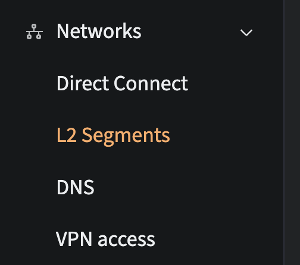
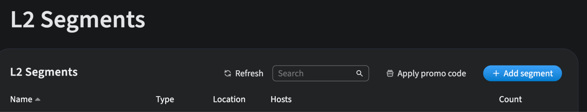
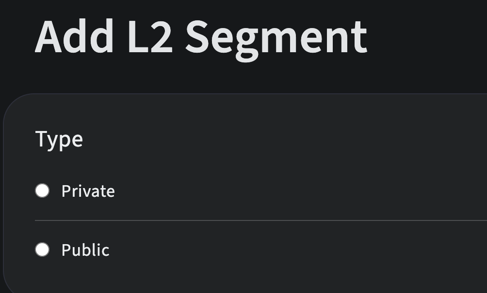
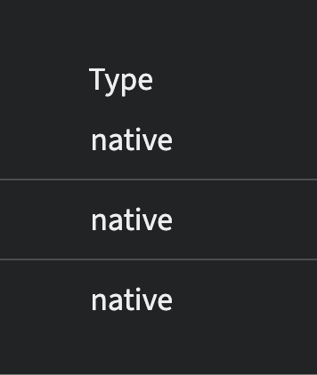
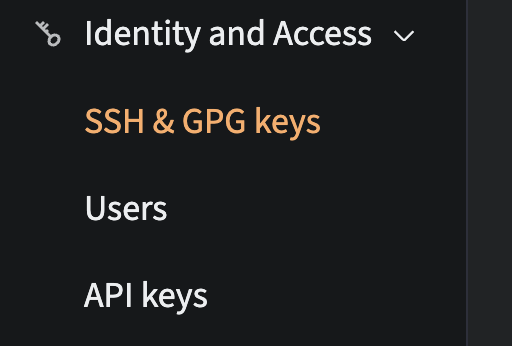
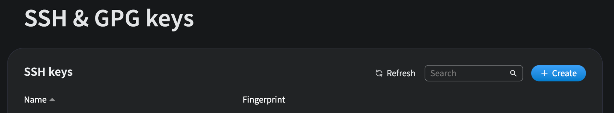
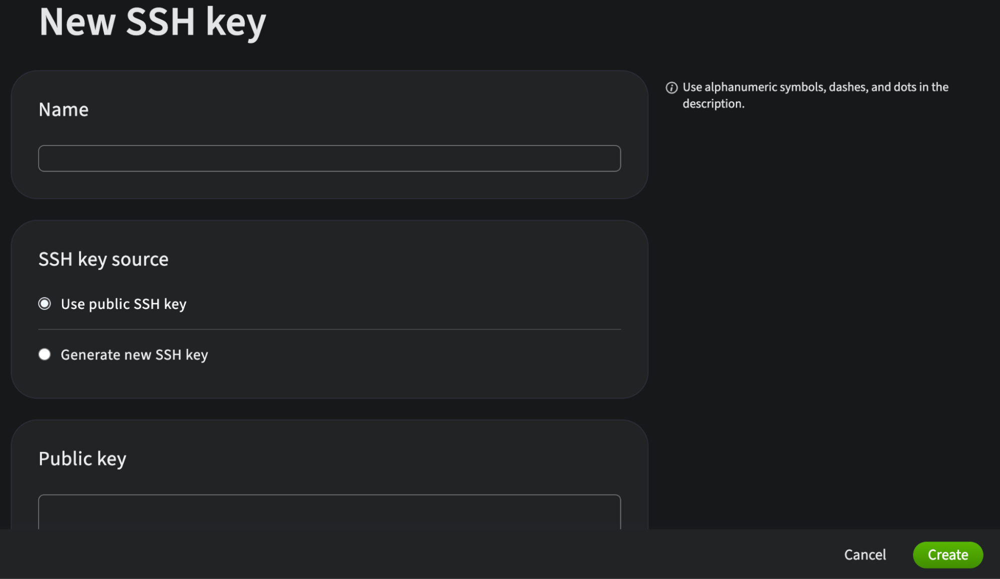

## Перед установкой

### 1. Сеть

1.  **Настройте L2 Network**

    1.  Перейдите в **Networks > L2 Segment** и нажмите **Add Segment**.

        

        

        

        Сначала выберите **Private**, выберите регион, добавьте серверы, задайте имя и сохраните.

    1.  Установите тип **Native**.
        Сделайте то же самое для **Public**.

        

### 2. Доступ

1.  Создайте SSH-ключи для доступа к серверу.

1.  Перейдите в **Identity and Access > SSH and Keys**.

    

1.  Создайте новые ключи или добавьте свои.

    
    

## Настройка ОС

### 1. Операционная система и доступ

{}
:warning: В rescue mode доступна только публичная сеть; частная L2 network недоступна.
Для установки Talos используйте обычную ОС (например, Ubuntu), а не rescue mode.
{}

1.  В панели управления Servers.com установите Ubuntu на сервер (например, через **Dedicated Servers > Server Details > OS install**) и убедитесь, что выбран ваш SSH-ключ.

1.  После завершения установки подключитесь по SSH, используя внешний IP сервера (**Details** > **Public IP**).

    

### 2. Установка Talos с boot-to-talos

Talos будет загружен из установленной Ubuntu с помощью утилиты [`boot-to-talos`](https://github.com/cozystack/boot-to-talos).
Позже, при применении конфигурации Talm, Talos будет установлен на диск.
Выполните эти шаги на каждом сервере.

1.  Проверьте информацию о блочных устройствах, чтобы найти диск, который позже будет использоваться для Talos (например, `/dev/sda`).

    ```console
    # lsblk
    NAME    MAJ:MIN   RM   SIZE     RO   TYPE   MOUNTPOINTS
    sda     259:4     0    476.9G   0    disk
    sdb     259:0     0    476.9G   0    disk
    ```

1.  Скачайте и установите `boot-to-talos`:

    ```bash
    curl -sSL https://github.com/cozystack/boot-to-talos/raw/refs/heads/main/hack/install.sh | sudo sh -s
    ```

    После установки проверьте, что бинарный файл доступен:

    ```bash
    boot-to-talos -h
    ```

1.  Запустите installer:

    ```bash
    sudo boot-to-talos
    ```

    При запросе:

-   Выберите режим `1. boot`.
-   Подтвердите или измените образ Talos installer (стандартный образ Cozystack подходит).
-   Укажите сетевые настройки, соответствующие публичному интерфейсу (`bond0`) и default gateway.

    Утилита скачает образ Talos installer и загрузит узел в Talos Linux (с помощью механизма kexec), не изменяя диски.

    Для полностью автоматизированной установки можно использовать non-interactive mode:

    ```bash
    sudo boot-to-talos -yes
    ```

### 3. Загрузка в Talos

После завершения `boot-to-talos` сервер автоматически перезагрузится в Talos Linux в maintenance mode.
Повторите ту же процедуру для всех серверов, затем переходите к их настройке с Talm.

## Конфигурация Talos

Используйте [Talm](https://github.com/cozystack/talm), чтобы применить config и установить Talos Linux на диск.

1. [Скачайте последний binary Talm](https://github.com/cozystack/talm/releases/latest) и сохраните его в `/usr/local/bin/talm`

1. Сделайте его исполняемым:

   ```bash
   chmod +x /usr/local/bin/talm
   ```

### Установка с Talm

1. Создайте каталог для нового кластера:

   ```bash
   mkdir -p cozystack-cluster
   cd cozystack-cluster
   ```

1. Выполните следующую команду, чтобы инициализировать Talm для Cozystack:

   ```bash
   talm init --preset cozystack --name mycluster
   ```

   После инициализации сгенерируйте шаблон конфигурации командой:

   ```bash
   talm -n 1.2.3.4 -e 1.2.3.4 template -t templates/controlplane.yaml -i > nodes/nodeN.yaml
   ```

1. При необходимости отредактируйте конфигурационный файл узла:

   1.  Обновите `hostname` на нужное имя.
       ```yaml
       machine:
         network:
           hostname: node1
       ```

   1.  Обновите `nameservers`, указав публичные серверы, потому что внутренний DNS servers.com недоступен из частной сети.
       ```yaml
       machine:
         network:
           nameservers:
             - 8.8.8.8
             - 1.1.1.1
       ```

   1.  Добавьте конфигурацию private interface и перенесите `vip` в этот раздел. Этот раздел не генерируется автоматически:
       -   `interface` - берется из "Discovered interfaces" путем сопоставления MAC-адреса private interface, указанного в письме провайдера.
           (Из двух интерфейсов выберите тот, у которого есть uplink).
       -   `addresses` - используйте адрес, указанный для Layer 2 (L2).

       ```yaml
       machine:
         network:
           interfaces:
             - interface: bond0
               addresses:
                 - 1.2.3.4/29
               routes:
                 - network: 0.0.0.0/0
                   gateway: 1.2.3.1
               bond:
                 interfaces:
                   - enp1s0f1
                   - enp3s0f1
                 mode: 802.3ad
                 xmitHashPolicy: layer3+4
                 lacpRate: slow
                 miimon: 100
             - interface: bond1
               addresses:
                 - 192.168.102.11/23
               bond:
                 interfaces:
                   - enp1s0f0
                   - enp3s0f0
                 mode: 802.3ad
                 xmitHashPolicy: layer3+4
                 lacpRate: slow
                 miimon: 100
               vip:
                 ip: 192.168.102.10
       ```

**Шаги выполнения:**

1.   Выполните `talm apply -f nodeN.yml` для всех узлов, чтобы применить конфигурации. Узлы будут перезагружены, и Talos будет установлен на диск.

1.   Убедитесь, что Talos установлен на диск, выполнив `talm get systemdisk -f nodeN.yml` для каждого узла. Вывод должен быть похож на:
     ```yaml
     NODE      NAMESPACE   TYPE         ID            VERSION   DISK
     1.2.3.4   runtime     SystemDisk   system-disk   1         sda
     ```

     Если вывод пустой, значит Talos все еще работает из RAM и еще не установлен на диск.
1.   Выполните bootstrap-команду для первого узла кластера, например:
     ```bash
     talm bootstrap -f nodes/node1.yml
     ```

1.   Получите `kubeconfig` с первого узла, например:
     ```bash
     talm kubeconfig -f nodes/node1.yml
     ```

1.   Отредактируйте `kubeconfig`, указав IP-адрес одного из узлов control plane, например:
     ```yaml
     server: https://1.2.3.4:6443
     ```

1.   Экспортируйте переменную для использования kubeconfig и проверьте подключение к Kubernetes:
     ```bash
     export KUBECONFIG=${PWD}/kubeconfig
     kubectl get nodes
     ```

Теперь для продолжения установки следуйте руководству **Get Started**, начиная с раздела [**Установка Cozystack**]({}).
