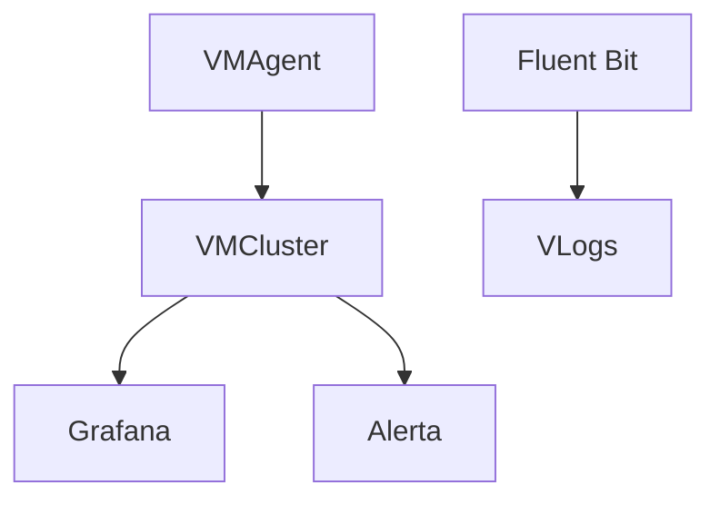
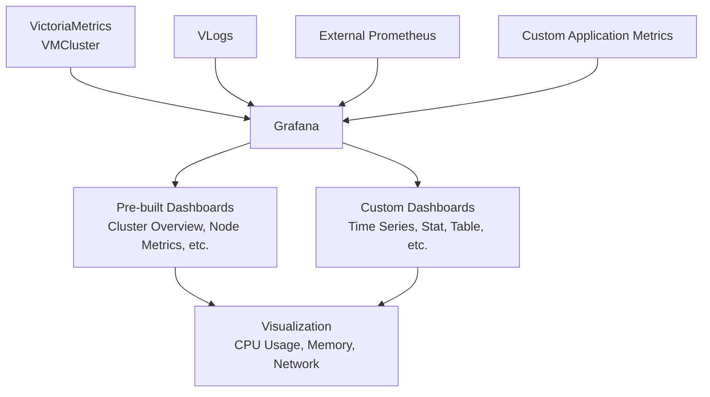
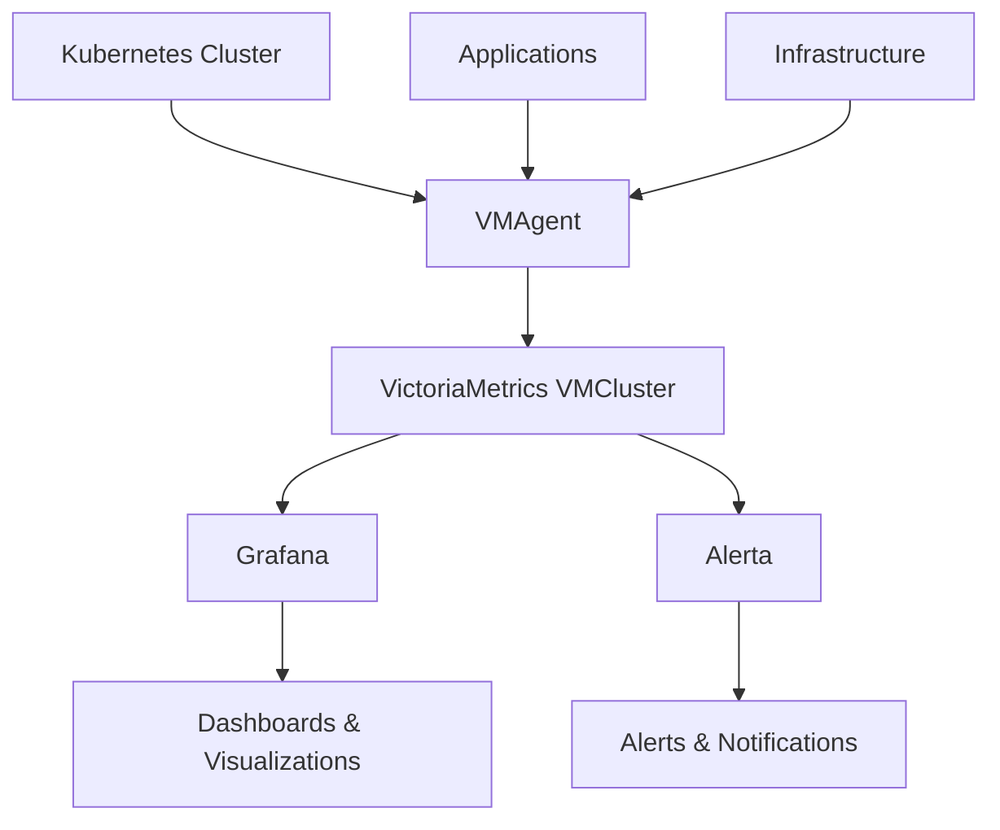
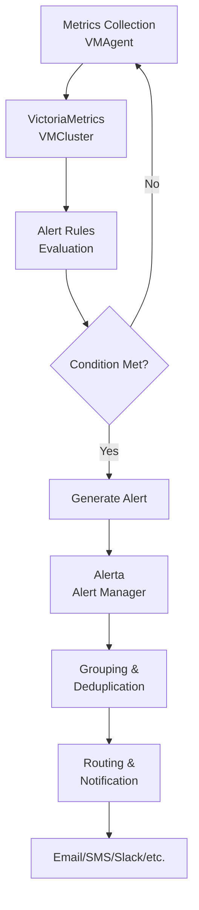
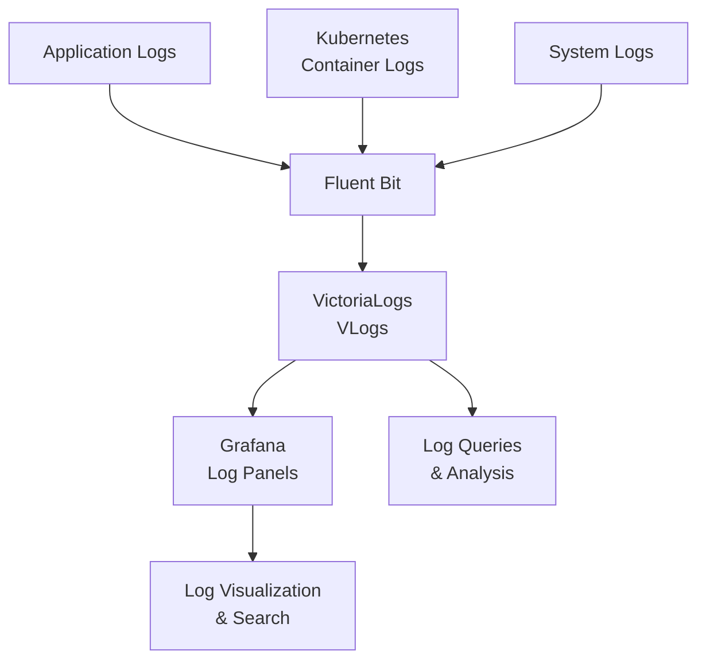

## Архитектура потоков данных

## Описание компонентов

- **VMAgent**: легкий agent, который собирает metrics из разных источников и отправляет их в VictoriaMetrics.
- **VMCluster**: кластер VictoriaMetrics, который хранит и обрабатывает time-series data для эффективных queries.
- **Grafana**: open-source платформа для monitoring и observability с настраиваемыми dashboards.
- **Alerta**: alerting system, которая обрабатывает и управляет alerts из monitoring systems.
- **Fluent Bit**: быстрый и легкий log processor и forwarder.
- **VLogs**: VictoriaLogs, высокопроизводительная система управления logs для хранения и запросов.

## Архитектура визуализации

### Описание компонентов визуализации

- **VictoriaMetrics VMCluster**: основное хранилище metrics и query engine, предоставляющий данные Grafana.
- **VLogs**: система VictoriaLogs для интеграции log data в visualizations.
- **External Prometheus**: дополнительные sources metrics, которые можно интегрировать.
- **Custom Application Metrics**: пользовательские metrics из приложений.
- **Grafana**: платформа визуализации, которая отображает dashboards.
- **Pre-built Dashboards**: стандартные dashboards для типовых monitoring views.
- **Custom Dashboards**: созданные пользователями dashboards с разными типами panels.
- **Visualization**: итоговый вывод с metrics вроде CPU, memory и network usage.

## Архитектура мониторинга

### Описание компонентов архитектуры мониторинга

- **Kubernetes Cluster**: основная платформа, где работают workloads и доступны metrics endpoints.
- **Applications**: пользовательские приложения, предоставляющие custom metrics.
- **Infrastructure**: базовое оборудование и системные metrics.
- **VMAgent**: собирает metrics из разных sources и отправляет их в VictoriaMetrics.
- **VictoriaMetrics VMCluster**: хранит и обрабатывает time-series metrics data.
- **Grafana**: предоставляет visualization и dashboarding.
- **Alerta**: управляет alerting и notifications.
- **Dashboards & Visualizations**: user interfaces для monitoring data.
- **Alerts & Notifications**: система уведомления operators о проблемах.

## Поток alerting

### Описание компонентов потока alerting

- **Metrics Collection**: сбор metrics из sources через VMAgent.
- **VictoriaMetrics VMCluster**: хранение и querying metrics data.
- **Alert Rules Evaluation**: проверка metrics по заранее заданным thresholds.
- **Generate Alert**: создание alert instances при выполнении условий.
- **Alerta Alert Manager**: обработка и управление alerts.
- **Grouping & Deduplication**: организация alerts для устранения duplicates.
- **Routing & Notification**: направление alerts в нужные channels.
- **Email/SMS/Slack/etc.**: конечные способы доставки notifications.

## Архитектура логирования

### Описание компонентов архитектуры логирования

- **Application Logs**: logs, генерируемые пользовательскими приложениями.
- **Kubernetes Container Logs**: logs контейнеров, работающих в Kubernetes.
- **System Logs**: infrastructure и system-level logs.
- **Fluent Bit**: легкий log processor, который собирает и пересылает logs.
- **VictoriaLogs VLogs**: высокопроизводительная система хранения и querying logs.
- **Grafana Log Panels**: интеграция для визуализации logs в Grafana dashboards.
- **Log Visualization & Search**: interfaces для просмотра и поиска log data.
- **Log Queries & Analysis**: tools для querying и анализа log information.
