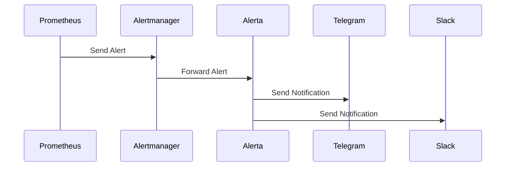

## Обзор

Система оповещения в Cozystack объединяет Prometheus, Alertmanager и Alerta, обеспечивая полноценный мониторинг и уведомления. Alerts создаются на основе метрик, собранных VMAgent и сохраненных в VMCluster, затем Alertmanager группирует их и устраняет дубликаты, после чего Alerta управляет отправкой уведомлений по различным каналам, например Telegram и Slack.

### Поток alerting



## Настройка alerts в Alerta

Alerta - это система оповещения, интегрированная в стек мониторинга Cozystack. Она обрабатывает алерты из разных источников и отправляет оповещения через несколько каналов.

### Alert rules

Алерты создаются на основе Prometheus правил, определенных в конфигурации мониторинга. Пользовательские правила оповещения можно настроить, изменив ресурсы PrometheusRule в namespace вашего tenant.

Чтобы создать свое правило оповещения, создайте манифесты PrometheusRule с выражениями, которые срабатывают при выполнении заданных условий. Каждое правило включает:

- **expr**: PromQL выражение для вычисления.
- **for**: время, в течение которого условие должно непрерывно выполняться перед срабатыванием алерта.
- **labels**: metadata, например severity.
- **annotations**: дополнительная информация, включаемая в уведомления.

Пример custom alert rule:

```yaml
apiVersion: monitoring.coreos.com/v1
kind: PrometheusRule
metadata:
  name: custom-alerts
  namespace: tenant-name
spec:
  groups:
  - name: custom.rules
    rules:
    - alert: HighCPUUsage
      expr: (1 - avg(rate(node_cpu_seconds_total{mode="idle"}[5m]))) * 100 > 80
      for: 5m
      labels:
        severity: warning
      annotations:
        summary: "Обнаружена высокая загрузка CPU"
        description: "Загрузка CPU выше 80% более 5 минут"
```

### Уровни severity

Alerta поддерживает следующие уровни критичности:

- **informational**: низкоприоритетная информация
- **warning**: потенциальные проблемы, требующие внимания
- **critical**: срочные проблемы, требующие немедленных действий
- **major**: значимые проблемы, влияющие на эксплуатацию
- **minor**: небольшие проблемы

В конфигурации Alerta можно задать, какие уровни критичности вызывают оповещение.

### Интеграции

#### Интеграция Telegram

Чтобы включить Telegram оповещения, задайте следующее в настройках monitoring:

```yaml
alerta:
  alerts:
    telegram:
      token: "your-telegram-bot-token"
      chatID: "chat-id-1,chat-id-2"
      disabledSeverity:
        - informational
```

#### Интеграция Slack

Для Slack оповещений:

```yaml
alerta:
  alerts:
    slack:
      url: "https://hooks.slack.com/services/YOUR/SLACK/WEBHOOK"
      disabledSeverity:
        - informational
        - warning
```

#### Интеграция Email

Чтобы включить email оповещения:

```yaml
alerta:
  alerts:
    email:
      smtpHost: "smtp.example.com"
      smtpPort: 587
      smtpUser: "alerts@example.com"
      smtpPassword: "your-password"
      fromAddress: "alerts@example.com"
      toAddress: "team@example.com"
      disabledSeverity:
        - informational
```

#### Интеграция PagerDuty

Для PagerDuty оповещений:

```yaml
alerta:
  alerts:
    pagerduty:
      serviceKey: "YOUR_PAGERDUTY_INTEGRATION_KEY"
      disabledSeverity:
        - informational
        - warning
```

Подробные параметры конфигурации см. в [справочнике Monitoring Hub]({}).

## Примеры alerts

Ниже приведены распространённые примеры алертов для мониторинга системы:

### Alert по CPU usage

```yaml
- alert: HighCPUUsage
  expr: 100 - (avg by(instance) (irate(node_cpu_seconds_total{mode="idle"}[5m])) * 100) > 80
  for: 5m
  labels:
    severity: warning
  annotations:
    summary: "Высокая загрузка CPU на {{ $labels.instance }}"
    description: "Загрузка CPU составляет {{ $value }}% более 5 минут"
```

### Alert по memory usage

```yaml
- alert: HighMemoryUsage
  expr: (1 - node_memory_MemAvailable_bytes / node_memory_MemTotal_bytes) * 100 > 90
  for: 5m
  labels:
    severity: critical
  annotations:
    summary: "Высокое использование памяти на {{ $labels.instance }}"
    description: "Использование памяти составляет {{ $value }}% более 5 минут"
```

### Alert по disk space

```yaml
- alert: LowDiskSpace
  expr: (node_filesystem_avail_bytes / node_filesystem_size_bytes) * 100 < 10
  for: 5m
  labels:
    severity: critical
  annotations:
    summary: "Мало свободного места на диске на {{ $labels.instance }}"
    description: "Доступное место на диске составляет {{ $value }}% более 5 минут"
```

### WorkloadNotOperational Alert

```yaml
- alert: WorkloadNotOperational
  expr: up{job="workload-monitor"} == 0
  for: 1m
  labels:
    severity: critical
  annotations:
    summary: "Workload {{ $labels.workload }} не работает"
    description: "Workload monitor сообщает, что workload недоступен"
```

### Alert по недоступному network interface

```yaml
- alert: NetworkInterfaceDown
  expr: node_network_up{device!~"lo"} == 0
  for: 2m
  labels:
    severity: critical
  annotations:
    summary: "Network interface {{ $labels.device }} недоступен на {{ $labels.instance }}"
    description: "Network interface недоступен более 2 минут"
```

### Alert по crash Kubernetes pod

```yaml
- alert: KubernetesPodCrashLooping
  expr: rate(kube_pod_container_status_restarts_total[10m]) > 0.5
  for: 5m
  labels:
    severity: warning
  annotations:
    summary: "Pod {{ $labels.pod }} находится в crash loop"
    description: "Pod перезапускается чаще одного раза за 2 минуты"
```

### Alert по высокой network latency

```yaml
- alert: HighNetworkLatency
  expr: node_network_receive_bytes_total / node_network_receive_packets_total > 1500
  for: 5m
  labels:
    severity: warning
  annotations:
    summary: "Высокая network latency на {{ $labels.instance }}"
    description: "Средний размер пакета превышает 1500 bytes, что может указывать на проблемы latency"
```

## Управление alerts

### Escalation

Alerts можно эскалировать на основе длительности и важности. Настройте политики эскалирования в Alerta, чтобы автоматически повышать критичность или уведомлять по дополнительным каналам, если алерт остается нерешенным.

Эскалация помогает гарантировать своевременное устранение критических проблем. Правила эскалации можно определить на основе:

- Time thresholds, например эскалация через 15 минут
- Severity levels
- Alert attributes, например конкретные сервисы или окружения

Пример настройки эскалации:

- Warning alerts переходят в critical через 30 минут
- Critical alerts немедленно уведомляют дежурных специалистов
- Major alerts уведомляют руководство через 1 час

Чтобы настроить эскалацию в Alerta, используйте web interface или API для настройки политик эскалации для разных alert types.

### Suppression

Alerts можно временно приостанавлитьва или отключать с помощью функции silencing в Alerta. Это полезно во время окон технического обслуживания, плановых простоев или расследования известных проблем, когда отправка уведомлений не требуется.

Silences можно создавать для конкретных алертов или на основе фильтров вроде окружения, ресурса или типа события. Silenced alerts остаются видимыми в дашборде Alerta, но не создают оповещений.

Чтобы создать silence:

1. Откройте web interface Alerta
2. Перейдите в раздел Alerts
3. Выберите alert для silence или используйте фильтры, чтобы silence применился к нескольким алертам
4. Выберите "Silence" и задайте длительность и причину

Либо используйте API:

```bash
curl -X POST https://alerta.example.com/api/v2/silences \
  -H "Authorization: Bearer YOUR_API_KEY" \
  -H "Content-Type: application/json" \
  -d '{
    "environment": "production",
    "resource": "server-01",
    "event": "HighCPUUsage",
    "startTime": "2023-12-01T00:00:00Z",
    "duration": 3600,
    "comment": "Scheduled maintenance"
  }'
```

Silences также можно управлять через Alertmanager для более продвинутой приостановки на основе маршрутизации.

## Конфигурация Alertmanager

Alertmanager выполняет маршрутизацию, группировку и дедупликацию алертов перед отправкой уведомлений. Он выступает посредником между Prometheus и системами оповещения, такими как Alerta.

### Grouping

Алерты можно группировать по меткам, чтобы снизить уровень шума и избежать перегрузки из-за большого количества оповещений. Настройте группировку в конфигурации Alertmanager:

```yaml
route:
  group_by: ['alertname', 'cluster', 'namespace']
  group_wait: 10s
  group_interval: 10s
  repeat_interval: 1h
  receiver: 'default'
```

- **group_by**: labels, по которым группируются alerts
- **group_wait**: время ожидания перед отправкой первого notification
- **group_interval**: interval между notifications для одной группы
- **repeat_interval**: минимальное время между notifications

### Routing

Маршрутизируйте алерты различным получателям на основе меток, чтобы отправлять адресные уведомления:

```yaml
route:
  receiver: 'default'
  routes:
  - match:
      severity: critical
    receiver: 'critical-alerts'
  - match:
      team: devops
    receiver: 'devops-team'
  - match_re:
      namespace: 'kube-.*'
    receiver: 'kubernetes-alerts'

receivers:
- name: 'default'
  slack_configs:
  - api_url: 'https://hooks.slack.com/services/YOUR/SLACK/WEBHOOK'
    channel: '#alerts'
- name: 'critical-alerts'
  pagerduty_configs:
  - service_key: 'YOUR_PAGERDUTY_KEY'
- name: 'devops-team'
  email_configs:
  - to: 'devops@example.com'
    from: 'alertmanager@example.com'
    smarthost: 'smtp.example.com:587'
    auth_username: 'alertmanager@example.com'
    auth_password: 'password'
- name: 'kubernetes-alerts'
  webhook_configs:
  - url: 'http://alerta.example.com/api/webhooks/prometheus'
    send_resolved: true
```

### Inhibition

Используйте правила подавления, чтобы не отправлять одни алерты, когда уже сработали другие связанные с ними алерты:

```yaml
inhibit_rules:
- source_match:
    alertname: 'NodeDown'
  target_match:
    alertname: 'PodCrashLooping'
  equal: ['node']
```

Подробнее о конфигурации Alertmanager см. в [официальной документации](https://prometheus.io/docs/alerting/latest/alertmanager/).
