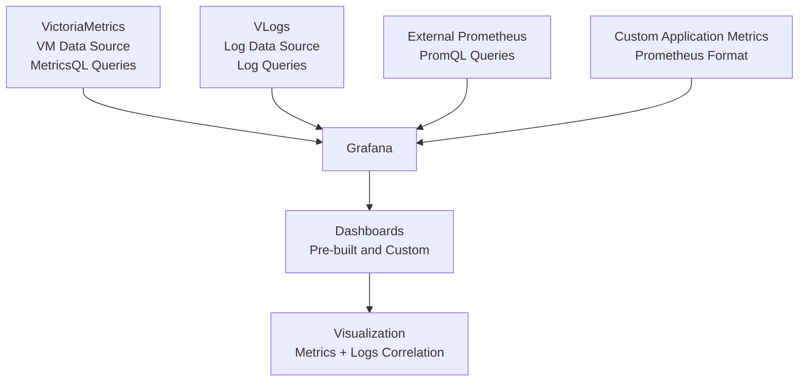

## Обзор

Cozystack интегрирует Grafana как основной инструмент визуализации метрик, собираемых VictoriaMetrics (VM). В этом разделе описан доступ к предварительно настроенным дашбордам, создание собственных визуализаций и подключение внешних источников данных для полноценной наблюдаемости кластеров и приложений Cozystack.

## Доступ к Grafana

Чтобы открыть Grafana и посмотреть дашборды:

1. Перейдите по URL Grafana: `https://grafana.<tenant-domain>`, где `<tenant-domain>` - домен вашего tenant.
2. Войдите в систему, используя учётные данные tenant (OIDC или token-based authentication).
3. После входа предварительно настроенные дашборды доступны в разделе "Dashboards".

Первичную настройку и детали конфигурации см. в [Monitoring Setup]({}).

## Pre-built dashboards

Cozystack предоставляет набор предварительно настроенные дашбордов в Grafana, которые автоматически разворачиваются и обновляются через monitoring stack. Эти дашборды определены в файле `packages/extra/monitoring/dashboards.list` и сразу дают представление о производительности системы и приложений.

### Dashboards инфраструктуры кластера

- **Kubernetes Cluster Overview**: дает верхнеуровневый обзор всего Kubernetes-кластера, включая статус узлов, health pods, использование CPU/memory/disk по кластеру и производительность API server. Полезен для быстрой проверки состояния кластера и выявления узких мест, связанных с ресурсами.
- **Node Metrics**: подробные метрики по узлам: CPU usage, memory consumption, disk I/O, network traffic и system load. Включает панели для отдельных узлов и агрегированные представления. Подходит для диагностики проблем конкретного узла.
- **ETCD Metrics**: мониторит состояние кластера ETCD, включая latency, storage usage, leader elections и database operations. Важен для надежности данных Kubernetes control plane.
- **Storage Metrics**: показывает компоненты хранения, такие как Linstor и SeaweedFS: volume usage, I/O operations, replication status и performance metrics. Помогает управлять ресурсами хранения данных и диагностировать связанные с ними проблемы.

### Dashboards приложений и сервисов

- **Tenant Applications**: Настраиваемые дашборды для пользовательских приложений, отображающие частоту запросов, частоту ошибок, время отклика и пропускную способность. Подходят для веб-сервисов, API и микросервисов, работающих в tenant namespaces.
- **Service Mesh**: метрики сетевых компонентов, включая ingress controllers (например, NGINX, Traefik), load balancers и service mesh proxies. Отображают характеристики трафика, задержки, частоту ошибок и состояние сетевой связности.
- **Database Metrics**: специализированные дашборды для поддерживаемых баз данных, таких как PostgreSQL, MySQL, Redis и других. Включают показатели производительности запросов, количество подключений, долю попаданий в кеш и метрики хранилища. Например, дашборд PostgreSQL отображает активные подключения, медленные запросы и состояние репликации.

Эти дашборды регулярно обновляются в новых релизах. Скриншоты и визуальные примеры см. в release notes с предпросмотром  дошбордов в [блоге Cozystack](https://cozystack.io/blog/).

## Создание custom dashboards

Если предварительно настроенные дашборды не покрывают ваши потребности, можно создавать пользовательские дашборды в Grafana, чтобы визуализировать конкретные метрики или объединять данные из нескольких источников.

### Шаги создания custom dashboard

1. **Откройте Grafana**: войдите в Grafana с tenant credentials.
2. **Создайте новый dashboard**: нажмите значок "+" в боковой панели и выберите "Dashboard".
3. **Добавьте панели**: нажмите "Add new panel", чтобы создать блок визуализации. Выберите тип панели и настройте источники данных.
4. **Настройте queries**: используйте MetricsQL (язык запросов VictoriaMetrics) для получения и преобразования данных.
5. **Настройте layout**: расположите панели, задайте временные диапазоны и добавьте аннотации или переменные для интерактивного взаимодействия с дашбордом.
6. **Сохраните и поделитесь**: сохраните дашбоард, настройте права доступа и при необходимости экспортируйте его для повторного использования.


### Примеры queries

Ниже несколько распространенных MetricsQL запросов для пользовательских панелей:

- **Использование CPU pod**:
  ```promql
  rate(container_cpu_usage_seconds_total{pod=~"$pod"}[5m])
  ```
  Показывает CPU usage rate для выбранных pods во времени.

- **Процент использования memory**:
  ```promql
  (1 - node_memory_MemAvailable_bytes / node_memory_MemTotal_bytes) * 100
  ```
  Показывает memory utilization на узлах в процентах.

- **Network traffic**:
  ```promql
  rate(node_network_receive_bytes_total[5m]) + rate(node_network_transmit_bytes_total[5m])
  ```
  Мониторит входящий и исходящий network traffic.

- **Response time приложения**:
  ```promql
  histogram_quantile(0.95, rate(http_request_duration_seconds_bucket{job="my-app"}[5m]))
  ```
  Вычисляет 95-й percentile response time для приложения.

### Типы panels и best practices

- **Time Series (Graph)**: Подходит для отображения изменений показателей во времени, например загрузки CPU или частоты запросов. Используйте этот тип визуализации для анализа исторических данных.
- **Stat**: показывает одиночные значения, например текущий процент CPU или общее число запросов. Удобен для быстрых метрик.
- **Table**: показывает табличные данные, например top процессов или сводные данные по оповещениям. Полезен для подробных списков.
- **Heatmap**: отображает плотность распределения значений, например частоту ошибок по временным интервалам. Эффективен для выявления закономерностей.
- **Gauge**: представляет значения на шкале, например процент использования диска.

При создании панелей учитывайте:
- Используйте подходящие временные промежутки и интервалы обновлений.
- Добавляйте пороговые значения и правила оповещения непосредственно на панели для проактивного мониторинга.
- Используйте переменные для динамической фильтрации, например по namespace или имени pod.

Расширенные queries и functions см. в [документации VictoriaMetrics MetricsQL](https://docs.victoriametrics.com/MetricsQL.html).

## Интеграция external data sources

Cozystack позволяет интегрироваться с внешними системами мониторинга, чтобы централизовать данные наблюдаемости.

### Добавление External Prometheus

Чтобы интегрировать внешний экземпляр Prometheus:

1. В Grafana перейдите в "Configuration" > "Data Sources" > "Add data source".
2. Выберите тип "Prometheus".
3. Укажите URL внешнего Prometheus, данные аутентификации (если требуются) и интервал сбора метрик.
4. Проверьте соединение и сохраните.
5. Используйте PromQL в dashboards, чтобы запрашивать внешние данные.

### Custom application metrics

Для приложений, предоставляющих пользовательские метрики:

- Убедитесь, что приложение предоставляет метрики в формате Prometheus, например через ендпоинт `/metrics`.
- Настройте VMAgent в Cozystack на scraping этих endpoints, обновив monitoring configuration.
- Метрики будут загружены в VM и доступны для запросов в Grafana.

Для совместимости соблюдайте [metric naming conventions](https://prometheus.io/docs/practices/naming/) Prometheus. Примеры конфигурации см. в [Monitoring Hub Reference]({}).

### Интеграция Grafana data sources

Эта диаграмма показывает, как внешние источники данных интегрируются в Grafana для централизованного мониторинга.



## Конфигурация data sources

Grafana в Cozystack заранее настроена с оптимизированными источниками данных для бесшовной интеграции.

### VictoriaMetrics (VM) Data Source

- **Type**: Prometheus совместимые (MetricsQL).
- **URL**: внутренний ендпоинт VM cluster в namespace tenant.
- **Authentication**: автоматическая через service account tokens.
- **Usage**: основной источник метрик временных рядов. Поддерживает высокопроизводительное выполнение запросов и агрегацию данных.

### VLogs Data Source

- **Type**: пользовательский плагин для запросов к логам.
- **Purpose**: включает визуализацию логов и корреляцию с метриками.
- **Configuration**: автоматически настраивается для tenant-specific потоков логов.
- **Usage**: добавляйте панели логгирования в дашборды, чтобы объединять метрики и логи, например для поиска проблем приложений.

Чтобы изменить настройки источников данных, откройте Grafana admin panel (нужны admin privileges) или обновите monitoring configuration через Cozystack API. Подробные параметры см. в [Monitoring Hub Reference]({}).
