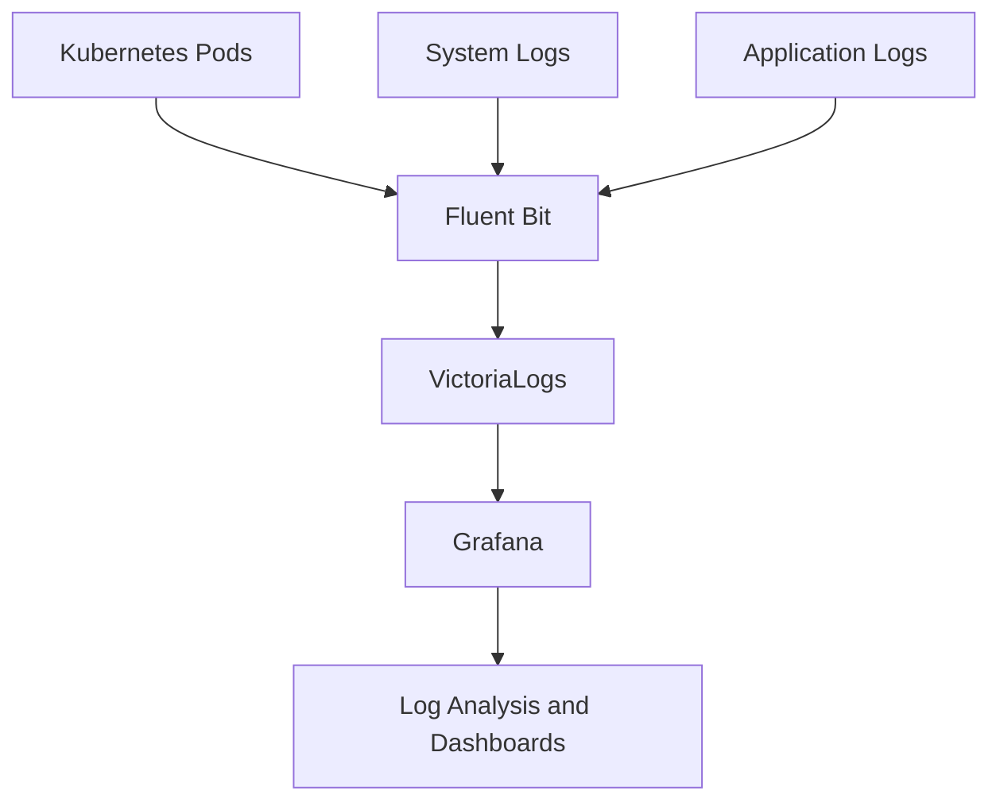

## Сбор и хранение логов

Cozystack использует Fluent Bit для сбора логов и VictoriaLogs для хранения и запросов. Логи собираются из разных источников внутри кластера и хранятся в выделенных log storages, настроенных для каждого tenant.

### Настройка logs storages

Log storages настраиваются через параметры monitoring hub. У каждого tenant может быть несколько экземпляров log storage с настраиваемыми периодами хранения и размерами хранилища.

| Параметр | Описание | Тип | По умолчанию |
|-----------|-------------|------|---------|
| `logsStorages` | Массив конфигураций log storage | `[]object` | `[]` |
| `logsStorages[i].name` | Имя экземпляра storage | `string` | `""` |
| `logsStorages[i].retentionPeriod` | Период хранения для логов, например "30d" | `string` | `"1"` |
| `logsStorages[i].storage` | Размер persistent volume | `string` | `"10Gi"` |
| `logsStorages[i].storageClassName` | StorageClass для хранения данных | `string` | `"replicated"` |

Подробные параметры конфигурации см. в [Monitoring Hub Reference]({}).

### Fluent Bit inputs и outputs

Fluent Bit настроен на сбор логов из:

- **Kubernetes Pods**: container logs из всех namespaces
- **System Logs**: логи уровня узла и системных сервисов
- **Application Logs**: пользовательские источники логов, подключаемые через sidecar-контейнеры.

#### Пример конфигурации Fluent Bit input

```yaml
apiVersion: v1
kind: ConfigMap
metadata:
  name: fluent-bit-config
data:
  fluent-bit.conf: |
    [INPUT]
        Name              tail
        Path              /var/log/containers/*.log
        Parser            docker
        Tag               kube.*
        Refresh_Interval  5

    [OUTPUT]
        Name  vlogs
        Match kube.*
        Host  vlogs-cluster
        Port  9428
```

Логи отправляются в VictoriaLogs для хранения и индексирования. Output plugin дополняет логи metadata, например именами pod, namespaces и временными метками.

## Архитектура логирования

Следующая диаграмма показывает архитектуру логирования в Cozystack: как логи проходят от разных источников к хранилищу и инструментам визуализации.



## Поиск и анализ логов

VictoriaLogs (VLogs) предоставляет мощные возможности запросов к сохраненным логам. Для расширенного анализа логов используйте VLogs через Grafana или напрямую через API.

### Использование VictoriaLogs

- **Query Language**: используйте синтаксис запросов VLogs, чтобы фильтровать логи по fields, time ranges и patterns.
- **Integration with Grafana**: визуализируйте логи вместе с метриками в dashboards.

#### Пример VLogs query

Чтобы найти записи об ошибках из конкретного пода:

```text
_level:ERROR AND kubernetes_pod_name: "my-app-pod"
```

### Filters и metadata

Логи в Cozystack содержат подробные метаданные для эффективной фильтрации:

- **Pod Metadata**: `kubernetes_pod_name`, `kubernetes_namespace_name`, `kubernetes_container_name`
- **Tenant**: `tenant` - определяет, к какому tenant относятся логи
- **Log Levels**: `_level` (INFO, WARN, ERROR и т. д.)
- **Timestamps**: автоматическое распознавание и обработка временных меток.
- **Custom Labels**: labels, относящиеся к конкретному приложению и добавляемые при сборе логов.

#### Расширенная фильтрация

Используйте сложные запросы для корреляции логов:

```text
kubernetes_namespace_name: "kube-system" AND _level: "WARN" AND _msg: *timeout*
```

Подробнее о запросах VLogs см. в [документации VictoriaLogs](https://docs.victoriametrics.com/victorialogs/).

## Просмотр логов tenant Kubernetes cluster

Когда рабочие нагрузки выполняются в [tenant Kubernetes cluster]({}), их логи собираются и отправляются в экземпляр VictoriaLogs родительского tenant. Затем эти логи можно запрашивать в Grafana с помощью специальных фильтров по label.

### Предварительные требования

Включите addon `monitoringAgents` в tenant Kubernetes cluster. Он разворачивает внутри кластера агентов, которые собирают логи и отправляют их в VictoriaLogs.

Через Cozystack дашборд задайте `addons.monitoringAgents.enabled: true` в параметрах Kubernetes application или примените это программно:

```yaml
addons:
  monitoringAgents:
    enabled: true
```

Подробности см. в [параметрах Managed Kubernetes]({}).

### Labels логов

Логи из tenant Kubernetes clusters обогащаются следующими labels:

| Label | Описание | Пример |
| --- | --- | --- |
| `tenant` | Идентификатор tenant (формат: `tenant-<name>`) | `tenant-workload` |
| `kubernetes_namespace_name` | Namespace внутри tenant Kubernetes cluster | `default` |
| `kubernetes_pod_name` | Имя pod | `my-app-6b7b8c9b89-ccqgf` |
| `kubernetes_container_name` | Имя container внутри pod | `my-app` |

### Запрос логов в Grafana

1. Откройте Grafana по адресу `https://grafana.<tenant-host>`
2. Перейдите в **Explore**
3. Выберите datasource **VictoriaLogs**
4. Используйте query builder или напишите query напрямую

#### Фильтр всех логов tenant

```text
tenant: "tenant-workload"
```

#### Фильтр по tenant и namespace

```text
tenant: "tenant-workload" AND kubernetes_namespace_name: "default"
```

#### Фильтр логов конкретного pod

```text
tenant: "tenant-workload" AND kubernetes_namespace_name: "default" AND kubernetes_pod_name: "my-app-6b7b8c9b89-ccqgf"
```

## Интеграция с приложениями

Чтобы повысить наблюдаемость логов, добавьте в приложения structured logging и enrichment labels.

### Structured logs

Используйте форматы structured logging, например JSON, для лучшего parsing и querying:

```json
{
  "timestamp": "2023-10-01T12:00:00Z",
  "level": "INFO",
  "message": "User login successful",
  "user_id": "12345",
  "action": "login"
}
```

### Обогащение логов labels

Добавляйте пользовательские labels в логи для расширенной фильтрации:

- **Tenant Labels**: автоматически добавляются для multi-tenancy
- **Application Labels**: custom labels, например `app_version`, `environment`
- **Business Labels**: domain-specific metadata

#### Пример конфигурации приложения

Настройте логгирование в приложении так, чтобы он включал структурированные данные:

```python
import logging
import json

logger = logging.getLogger(__name__)

def log_event(level, message, **kwargs):
    log_entry = {
        "timestamp": datetime.utcnow().isoformat(),
        "level": level,
        "message": message,
        **kwargs
    }
    logger.info(json.dumps(log_entry))
```

Убедитесь, что парсеры Fluent Bit настроены на обработку вашего формата логов. Подробности настройки см. в [Monitoring Setup]({}).
