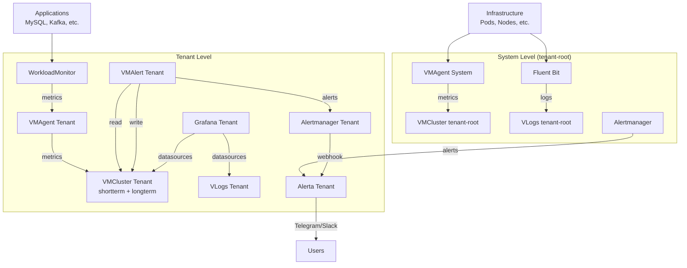

## Обзор

Cozystack предоставляет комплексную систему monitoring и alerting для Kubernetes-кластеров и приложений. Система основана на Victoria Metrics для хранения метрик и логов, Grafana для визуализации, Alerta для оповещений и WorkloadMonitor для мониторинга состояния приложений.

Архитектура разделена на два уровня:

- **Системный уровень**: мониторинг инфраструктуры кластера
- **Уровень tenant**: изолированный мониторинг для каждого tenant

## Установка мониторинга

### Системный monitoring

System monitoring устанавливается автоматически при развертывании платформы через HelmRelease `monitoring-agents` в `packages/apps/kubernetes/templates/helmreleases/monitoring-agents.yaml`.

Для ручной установки через локальный chart:

```bash
helm upgrade --install monitoring-agents ./packages/system/monitoring-agents -n cozy-monitoring --create-namespace
```

### Мониторинг tenant

Мониторинг для конкретного tenant активируется patch ресурса Tenant (CRD `apps.cozystack.io/v1alpha1/Tenant`).

#### Через Dashboard UI

1. Откройте Cozystack dashboard
2. Перейдите в управление tenant
3. Выберите tenant и задайте `monitoring: true` в values

#### Программно

```bash
kubectl patch tenant <tenant-name> --type merge -p '{"spec":{"values":{"monitoring": true}}}'
```

После активации FluxCD автоматически разворачивает HelmRelease `monitoring` в namespace tenant из шаблона `packages/apps/tenant/templates/monitoring.yaml`.

## Архитектура компонентов

### Системный уровень

#### VMAgent
- **Роль**: agent для сбора cluster метрик
- **Конфигурация**:
  - Scrape interval: 30 секунд
  - External labels: `cluster: cozystack, tenant: tenant-root`
  - Remote write: в VMCluster tenant-root (shortterm и longterm)
- **Источники метрик**:
  - Kubernetes API (Pods, Services, Deployments)
  - kube-state-metrics
  - Node Exporter
  - cAdvisor (via kubelet)

#### VMRule
- **Recording Rules**: агрегированные метрики
  - `container_memory:kmem` - kernel memory контейнеров
  - `kube_persistentvolume_is_local` - Local PVs
  - `kube_controller_pod` - связи Pod с контроллерами
- **Alerting Rules**: стандартные алерты Prometheus
  - `TargetDown` - недоступные таргеты
  - `Watchdog` - тестовый алерт
  - Kubernetes-specific alerts (apiserver, etcd, nodes, pods)

#### Fluent Bit
- **Роль**: сбор и агрегация логов
- **Inputs**:
  - Container logs: `/var/log/containers/*.log`
  - Kubernetes events
  - Audit logs: `/var/log/audit/kube/*.log`
- **Outputs**: Victoria Logs (`vlogs-generic.tenant-root.svc:9428`)
- **Parsers**: docker, cri, kubernetes metadata

#### Alertmanager
- **Роль**: routing alerts
- **Конфигурация**:
  - Grouping по `alertname`, `namespace`, `cluster`
  - Routes: Alerta webhook, blackhole для `severity="none"`
- **Интеграция**: webhook в Alerta для нотификаций

### Уровень tenant

#### Victoria Metrics Cluster
- **Компоненты**:
  - `vminsert`: прием метрик (2 replicas)
  - `vmselect`: запросы метрик (2 replicas, 2Gi cache)
  - `vmstorage`: хранение метрик (2 replicas, 10Gi PVC)
- **Storage**:
  - Shortterm: хранение 3 дня, дедупликация 15s
  - Longterm: хранение 14 дней, дедупликация 5m
  - Replication: factor 2

#### Victoria Logs
- **Роль**: хранение структурированных логов
- **Конфигурация**: хранение 1 год, 10Gi PVC

#### Grafana
- **Роль**: визуализация метрик и логов
- **Database**: PostgreSQL (10Gi PVC)
- **Datasources**:
  - Victoria Metrics (метрики)
  - Victoria Logs (логи)
- **Ingress**: `grafana.{tenant-host}`
- **Resources**: 2 replicas, limits 1 CPU/1Gi RAM
- **Dashboards**: готовые дашборды для всех компонентов Cozystack

#### Alerta
- **Роль**: централизовання система оповещения
- **Database**: PostgreSQL (10Gi PVC)
- **Notifications**: Telegram, Slack
- **API**: Protected by API key
- **Ingress**: `alerta.{tenant-host}`

#### VMAlert (tenant)
- **Роль**: вычисление правил алертинга для tenant
- **Datasource**: запросы к краткосрочным данным
- **Remote write**: запись краткосрочных данных
- **Evaluation interval**: 15 seconds

#### VMAgent (tenant)
- **Роль**: сбор метрик из namespace tenant
- **Selector**: `namespace.cozystack.io/monitoring`
- **External labels**: `cluster: cozystack, tenant: {namespace}`
- **Remote write**: запись краткосрочных и долгосрочных данных

## Мониторинг приложений

### WorkloadMonitor CRD

WorkloadMonitor (`cozystack.io/v1alpha1/WorkloadMonitor`) в первую очередь используется для биллинга, отслеживания состояний workloads и сбора метрик ресурсов. Alerting является дополнительной функцией.

#### Спецификация

```yaml
apiVersion: cozystack.io/v1alpha1
kind: WorkloadMonitor
metadata:
  name: mysql-instance
spec:
  replicas: 1
  minReplicas: 1
  kind: mysql
  type: mysql
  selector:
    app.kubernetes.io/instance: mysql-instance
  version: "10.11"
```

#### Status

```yaml
status:
  operational: true  # true, если AvailableReplicas >= MinReplicas
  availableReplicas: 1
  observedReplicas: 1
```

### WorkloadMonitor Controller

- Отслеживает Pods, PVCs, Services по selector
- Создает CRD Workload с агрегированными метриками для биллинга
- Экспортирует metrics через kube-state-metrics

### Alerting Integration

Хотя WorkloadMonitor предназначен для биллинга, он также интегрируется с alerting. Alert срабатывает при `cozy_workload_status_operational{operational="false"} == 1`:

1. VMAlert вычисляет rule
2. Отправляет alert в Alertmanager
3. Alertmanager направляет его в Alerta
4. Alerta отправляет notifications (Telegram/Slack)

### Примеры для приложений

#### MySQL

```yaml
apiVersion: cozystack.io/v1alpha1
kind: WorkloadMonitor
metadata:
  name: {{ .Release.Name }}
spec:
  replicas: {{ .Values.replicas }}
  minReplicas: 1
  kind: mysql
  type: mysql
  selector:
    app.kubernetes.io/instance: {{ .Release.Name }}
  version: {{ .Chart.Version }}
```

#### Kafka

Для Kafka:

```yaml
apiVersion: cozystack.io/v1alpha1
kind: WorkloadMonitor
metadata:
  name: {{ .Release.Name }}-kafka
spec:
  replicas: {{ .Values.kafka.replicas }}
  minReplicas: 1
  kind: kafka
  type: kafka
  selector:
    app.kubernetes.io/name: kafka
    app.kubernetes.io/instance: {{ .Release.Name }}
  version: {{ .Chart.Version }}
```

Для Zookeeper:

```yaml
apiVersion: cozystack.io/v1alpha1
kind: WorkloadMonitor
metadata:
  name: {{ .Release.Name }}-zookeeper
spec:
  replicas: {{ .Values.zookeeper.replicas }}
  minReplicas: 1
  kind: zookeeper
  type: zookeeper
  selector:
    app.kubernetes.io/name: zookeeper
    app.kubernetes.io/instance: {{ .Release.Name }}
  version: {{ .Chart.Version }}
```

Аналогичные конфигурации применяются для PostgreSQL, Redis, ClickHouse, RabbitMQ, NATS и других приложений.

## Поток данных



## Конфигурация и настройка

### Параметры values.yaml

#### Системный monitoring (`packages/system/monitoring-agents/values.yaml`)

```yaml
# VMAgent
vmagent:
  shardCount: 1
  externalLabels:
    cluster: cozystack
    tenant: tenant-root
  remoteWrite:
    - url: "http://vminsert-shortterm.tenant-root.svc:8480/insert/0/prometheus"
    - url: "http://vminsert-longterm.tenant-root.svc:8480/insert/0/prometheus"

# Fluent Bit
fluent-bit:
  inputs:
    - tail:
        path: /var/log/containers/*.log
    - kubernetes_events:
        kube_url: https://kubernetes.default.svc:443
  outputs:
    - vlogs:
        url: http://vlogs-generic.tenant-root.svc:9428
```

#### Monitoring tenant (`packages/extra/monitoring/values.yaml`)

```yaml
# VMCluster
metricsStorages:
  shortterm:
    retention: "3d"
    deduplication: "15s"
  longterm:
    retention: "14d"
    deduplication: "5m"

# Grafana
grafana:
  host: grafana.example.com
  resources:
    limits:
      cpu: 1
      memory: 1Gi

# Alerta
alerta:
  host: alerta.example.com
  telegram:
    token: "your-telegram-token"
  slack:
    webhook: "your-slack-webhook"
```

### Dashboard Grafana

Cozystack включает готовые дашборды для:

- **Kubernetes**: nodes, pods, control-plane
- **Victoria Metrics**: cluster, agent, alert
- **Applications**: nginx, postgres, redis, kafka, mysql, etc.
- **Flux**: control-plane, stats
- **Storage**: linstor, seaweedfs

Dashboards определены в `packages/extra/monitoring/dashboards.list`.

Чтобы открыть Grafana:

1. Перейдите на `https://grafana.{tenant-host}`
2. Войдите с дефолтными учетными данными (admin/admin) или настроенными
3. Посмотрите готовые дашборды в разделе Dashboards

## Безопасность и масштабируемость

### Безопасность

- **RBAC**: минимальные права для service accounts
- **Network Policies**: ограничение трафика между компонентами
- **TLS**: Ingress с TLS сертификатами
- **API Keys**: аутентификация для Alerta

### Масштабируемость

- **Horizontal Pod Autoscaling**: для компонентов VM
- **Resource Limits**: настраиваемые CPU/Memory
- **Storage**: PVC с настраиваемым storageClass
- **Sharding**: VMAgent поддерживает распределение нагрузки

## Интеграции

- **Alertmanager**: Webhook, email, PagerDuty, Slack
- **Grafana**: plugins для Victoria Metrics, Loki
- **External Storage**: remote write во внешние VM instances
- **GitOps**: управление через FluxCD

## Диагностика и troubleshooting

### Проверка состояния

Чтобы проверить настройку мониторинга:

```bash
# Проверить status VMCluster
kubectl get vmcluster -n <tenant-namespace>

# Проверить pods VMAgent
kubectl get pods -n cozy-monitoring -l app.kubernetes.io/name=vmagent

# Проверить pods Grafana
kubectl get pods -n <tenant-namespace> -l app.kubernetes.io/name=grafana

# Проверить pods Alerta
kubectl get pods -n <tenant-namespace> -l app.kubernetes.io/name=alerta

# Проверить status WorkloadMonitor
kubectl get workloadmonitor -n <tenant-namespace>
```

### Просмотр логов

```bash
# Логи VMAgent
kubectl logs -n cozy-monitoring deployment/vmagent

# Логи VMAlert
kubectl logs -n <tenant-namespace> deployment/vmalert

# Логи Fluent Bit
kubectl logs -n cozy-monitoring daemonset/fluent-bit

# Логи Grafana
kubectl logs -n <tenant-namespace> deployment/grafana
```

### Типичные проблемы

- **Metrics не собираются**: проверьте selectors в ресурсах VMServiceScrape
- **Alerts не срабатывают**: проверьте rules в ресурсах VMRule и конфигурацию Alertmanager
- **Logs не поступают**: проверьте конфигурацию Fluent Bit и outputs
- **WorkloadMonitor не работает**: проверьте selector labels и status CRD
- **Grafana недоступна**: проверьте ingress configuration и TLS certificates
- **Alerta notifications не отправляются**: проверьте API keys и webhook URLs

### Дополнительные troubleshooting-команды

```bash
# Проверить health VMCluster
kubectl describe vmcluster -n <tenant-namespace>

# Вывести active alerts
kubectl get prometheusrules -n <tenant-namespace>

# Проверить network policies
kubectl get networkpolicies -n <tenant-namespace>

# Проверить RBAC permissions
kubectl auth can-i get pods --as=system:serviceaccount:<namespace>:<serviceaccount>
```

Эта документация покрывает все аспекты monitoring и alerting в Cozystack на основе анализа реального кода проекта.
