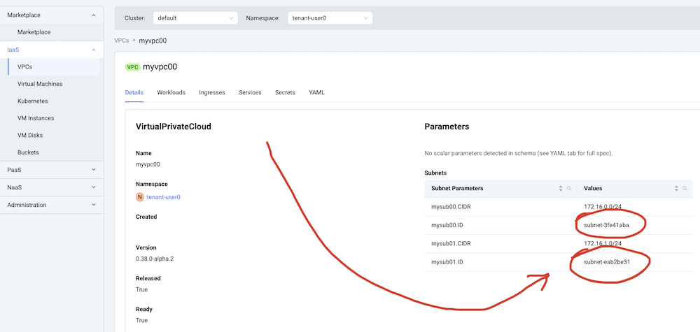
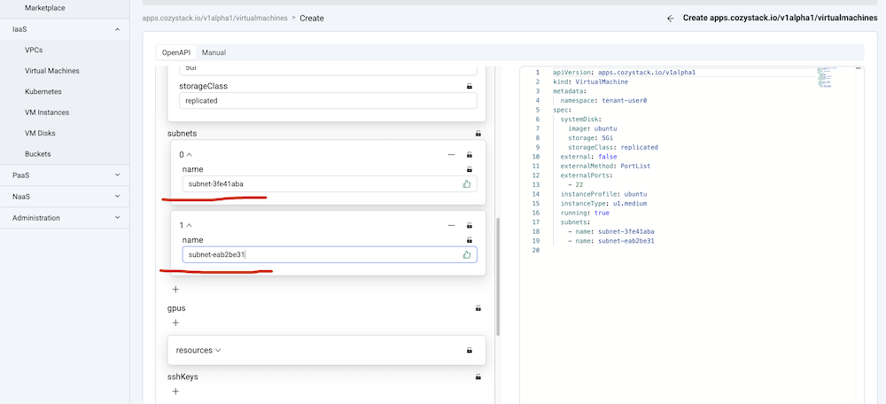

## Подключение workloads к подсетям

После создания VPC с набором подсетей к ним можно подключать рабочую нагрузку.
Сейчас подключение к подсетям поддерживают только виртуальные машины.

### 1. Получите ID подсетей

Сначала нужно определить ID подсетей. ID автоматически формируются из имен ресурсов, указанных при создании.
Проверьте их на вкладке Details вашей VPC.

### 2. Укажите ID подсетей при создании ресурса

При создании VM укажите ID подсетей в разделе Subnets настроек ресурса.

Каждая подсеть будет представлена как дополнительный сетевой интерфейс.
Для некоторых гостевых операционных систем нужно добавить конфигурацию сетевого интерфейса в user-data виртуальной машины.
Также можно поднять дополнительные интерфейсы вручную и получить IP-адреса через DHCP.
